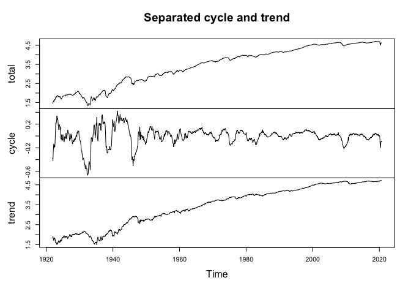
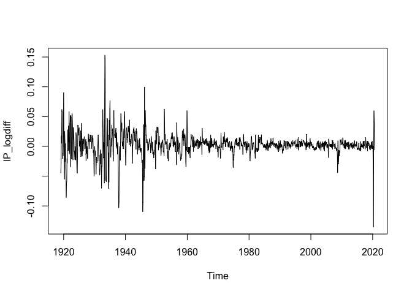

<!-- README.md is generated from README.Rmd. Please edit that file -->

# tsfilters

The goal of tsfilters is to provide various time series filters.

## Installation

You can install the released version of tsfilters from
[GitHub](https://github.com/) with:

``` r
# install.packages("devtools")
devtools::install_github("saviviro/tsfilters")
```

## Example

Separate trend and cyclical component of univariate time series using
the method proposed by Hamilton (2018, <doi:10.1162/rest_a_00706>).

``` r
library(tsfilters)
data(INDPRO, package="tsfilters")
IP_filtered <- hfilter(log(INDPRO), h=24, p=12)
IP_filtered
#> Separated trend and cyclical component:
#>  h = 24, p = 12 
#>  T = 1186, freq = 12 
#>  start = (1921, 12), end = (2020, 9) 
#> 
#> Coefficients:
#>  beta_0  beta_1  beta_2  beta_3  beta_4  beta_5  beta_6  beta_7  beta_8  beta_9 
#>   0.166   1.589  -0.845   0.118  -0.040   0.052  -0.010   0.032  -0.108  -0.194 
#> beta_10 beta_11 beta_12 
#>  -0.013  -0.232   0.623
plot(IP_filtered)
```



``` r

# The first difference of logarithmized series:
IP_logdiff <- logdiff(INDPRO)
plot(IP_logdiff)
```


